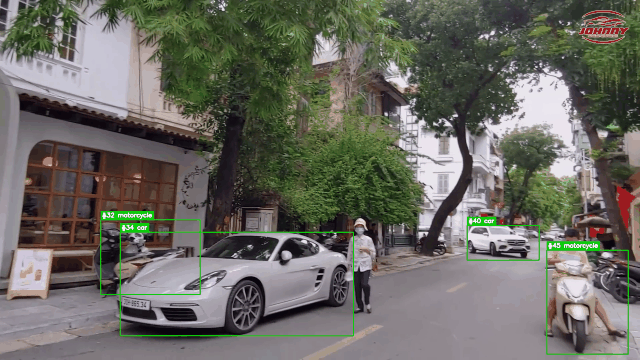

# Vietnamese License Plate Recognition (ALPR) from Video

An end-to-end pipeline that reads **Vietnamese license plates** from real traffic video and
outputs one plate per tracked vehicle with confidence scores. The project spans the full
lifecycle of a computer-vision system: **data collection → labeling → training → evaluation →
integration → end-to-end**.


## Highlights

- **Corner regression** (YOLO11-pose, 4 keypoints) warps skewed plates with `warpPerspective`
  when tilt exceeds **15°** — accuracy on heavily-tilted plates jumped **46.3% → 83.3%**.
- **PaddleOCR** (PP-OCRv5) replaced EasyOCR — OCR exact-match jumped **6.6% → 74.6%**.
- **Position-wise voting fusion** merges multiple reads of one track *per character position*,
  so a single wrong character never splits the vote (and it detects "two plates mixed in one track").
- **SORT tracker** (Kalman + Hungarian + IoU) implemented from scratch with only NumPy.
- **Robust engineering**: Unicode-path I/O on Windows, NaN guards, per-module error isolation so
  the pipeline degrades gracefully instead of crashing.

## Demo

<p align="center">
  
  <br/><i>Vehicle detection + SORT tracking + plate OCR on real traffic (minutes 3–9, 64 plates) — full clip: <a href="docs/assets/demo.mp4">demo.mp4</a></i>
</p>

## Architecture (8 modules)

```
video.mp4
  ├─ M0  FrameExtractor              extract & filter frames (blur / brightness)
  ├─ M1  VehicleDetector (YOLO11n)   detect vehicles (car / motorcycle / bus / truck)
  ├─ M3  SortTracker → track_id      track each vehicle across frames
  ├─ M2  PlateDetector (YOLO11n)     localize the license plate
  ├─ ★   CornerRegressor (YOLO11n-pose, 4 kpt) → warpPerspective if tilt > 15°
  ├─ M4  Preprocess                  deskew (projection profile) → split 2 lines → CLAHE
  ├─ M5  OCR (PaddleOCR / EasyOCR)   read the text
  ├─ M6  Postprocess / Fusion        plate rules + voting + position-wise fusion
  └─ M7  Output                      JSON + CSV + TXT + video overlay
```

## Results (measured on 213 real images)

| Metric | Before | After |
|---|---|---|
| OCR engine (exact match) | EasyOCR **6.6%** | PaddleOCR **74.6%** |
| Skewed plates (tilt > 15°) | bbox + affine **46.3%** | corner-warp **83.3%** |
| End-to-end exact | **70.4%** | **79.8%** (0.923 similarity) |
| Plate detection | — | **mAP50-95 = 0.73** |

## Project structure

```
main.py                       # CLI — run the video pipeline
train_detector.py             # fine-tune the YOLO11n plate detector
download_datasets.py          # fetch 3 public Vietnamese-plate datasets (Roboflow)
dataset_prep_src/
  ├── src/                    # core library (18 modules)
  └── tools/                  # 41 scripts in data/ train/ eval/ run/ sample/ check/ utils/
docs/                         # detailed module docs
labeling/                     # hand-labeled ground truth (CSV) + labeling guide
REPORT.md                     # full journey report (challenges, decisions, improvements)
```

## Installation

The pipeline uses **two virtual environments** to avoid a PyTorch / PaddlePaddle CUDA conflict:

```powershell
# venv 1 — PyTorch + Ultralytics (YOLO)
python -m venv .venv-datasets
.venv-datasets\Scripts\pip install -r requirements.txt

# venv 2 — PaddleOCR
python -m venv .venv-paddle
.venv-paddle\Scripts\pip install paddlepaddle paddleocr
```

## Usage

```powershell
# Full video pipeline (detect → track → read → vote → output)
.venv-datasets\Scripts\python main.py --video videodemo2.mp4 --device 0 --save-overlays
```

## Reproduce from scratch

```powershell
# 1. Download data
python tools/data/download_ccpd.py          # CCPD2019
python download_datasets.py                  # Roboflow (needs ROBOFLOW_API_KEY)

# 2. Build the pose dataset
python tools/data/ccpd_to_pose.py --src <ccpd_extracted> --out datasets/ccpd_pose

# 3. Train
python train_detector.py --epochs 50 --batch 8
python tools/train/train_pose_ccpd.py --mode augmented
python tools/train/train_corner_regressor.py --epochs 100

# 4. Evaluate
python tools/eval/eval_corner_regressor.py
python tools/eval/eval_fusion.py

# 5. Run end-to-end
python tools/run/run_full.py
```

## Documentation

Read **[docs/README.md](docs/README.md)** for per-module explanations and the **"special logic" cheat-sheet**
(SORT, position-wise fusion, corner gating, projection-profile deskew).

## Key technical decisions

- **Why corner regression?** A perspective-warped plate crops flat, unlike an affine-deskewed one.
- **Why position-wise fusion?** Whole-string voting is fragile — one OCR error splits the vote.
- **Why two venvs?** PaddlePaddle and PyTorch have conflicting CUDA dependencies; running OCR in a
  subprocess sidesteps it.
- **Why `fliplr=0` during training?** Flipping a plate reverses the character order.
